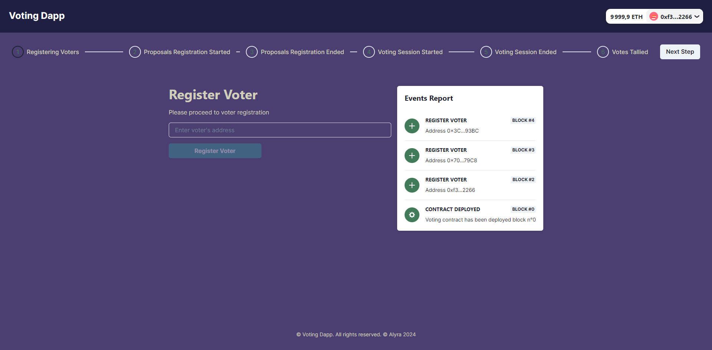
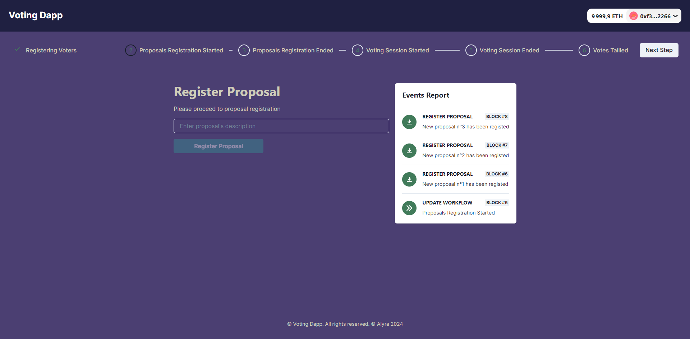
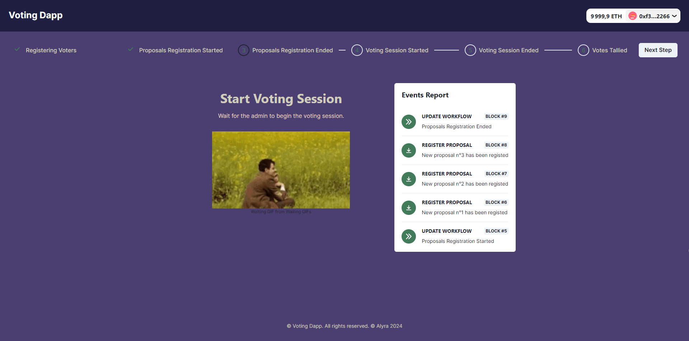
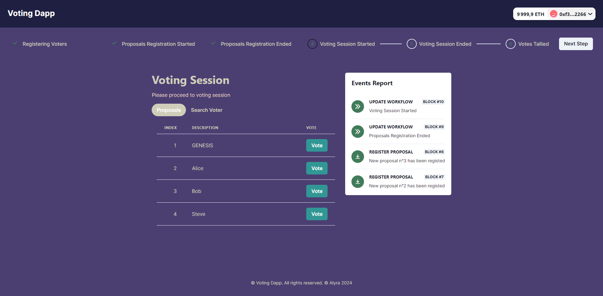
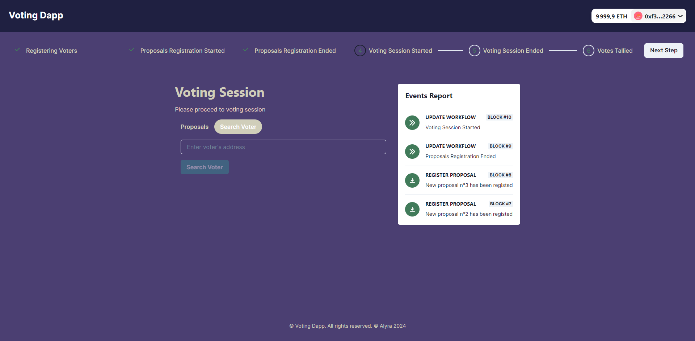
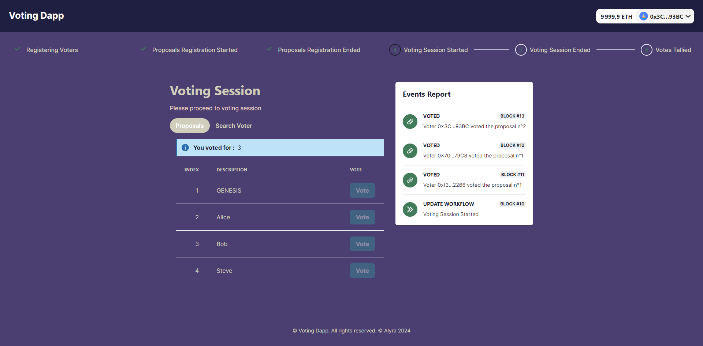
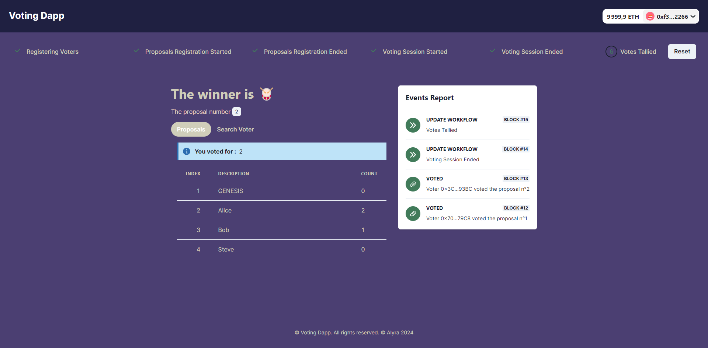

<h1 align="center">Projet 3 : Dapp Voting</h1>

  

<h2 align="center">📘 Pour correction :</h2>

<strong>Lien vidéo</strong> (durée 3 min 07 sec, vous pouvez la regarder en 1.2x, cela vous fera donc 2 min 35 sec) : <a href="https://www.loom.com/share/0612121444484927a82d6c9ebe39d3eb">https://www.loom.com/share/0612121444484927a82d6c9ebe39d3eb</a>

<strong>Lien Déploiement</strong> : <a href="https://voting-dapp-ten-blush.vercel.app">https://voting-dapp-ten-blush.vercel.app</a>

<strong>Déployé sur sépolia</strong> : <code>0x35312cf73B9d7361470eDDBdfd0E2EA887AD932C</code>

<strong>Groupe constitué de :</strong> 
- Léo-Paul MARTIN 
- Pierre ORGERET

<h2 align="center">📁 Détails</h2>

<h3 align="center">📜 Contract</h3>

La faille a été corrigée comme suit : nombre maximum de proposal 5.

Niveaux bonnes pratiques nous avons fait ceci :

<ul>
  <li><strong>Overall</strong>
    <ul>
      <li>Bon partage des taches (contrat + test, frontend voting steps, déploiement)</li>
      <li>Frontend et backend en TypeScript</li>
    </ul>
  </li>
  <li><strong>Backend</strong>
    <ul>
      <li>Backend scripts :
        <ul>
          <li>deployer contrat: <code>yarn run deploy-ll</code> (hardhat) et <code>yarn run deploy-se</code> (sepolia)</li>
          <li>voir la liste des proposals : <code>yarn run proposal-ll</code> (hardhat) et <code>proposal-se</code> (sepolia)</li>
          <li>reset le workflow/clear proposals et voters : <code>reset-ll</code> (hardhat) et <code>reset-se</code> (sepolia)</li>
          <li>update le workflow manually</li>
          <li>automatiser la démo</li>
        </ul>
      </li>
      <li>Backend script dans le <code>package.json</code> pour run les commandes hardhat (compile, test, coverage, node, deploy, proposal, reset)</li>
      <li>Backend test coverage 100% statement, branches, functions, and lines, utilisation de fixture et <code>loadFixture</code> partout</li>
    </ul>
  </li>
  <li><strong>Frontend</strong>
    <ul>
      <li>React context</li>
      <li><a href="https://coolors.co/1f2041-4b3f72-417b5a-d0ceba-e9d2c0">Colors</a></li>
      <li>Message d'alerte quand blockchain down/contract not deployed ou mauvais contrat target</li>
      <li>Variable d'environnement pour update les variables importantes depuis vercel sans update le code
        <ul>
          <li>contract address</li>
          <li>numéro de block de déploiement (début d'écoute des events)</li>
          <li>projectId de walletConnect</li>
          <li>rpc url Sepolia</li>
        </ul>
      </li>
    </ul>
  </li>
</ul>

<h3 align="center">🧪 Testing</h3>

<ul>
  <li><strong>Backend</strong>
    <ul>
      <li>Coverage 100% statement, branches, functions, and lines
      <li>Utilisation de fixture et <code>loadFixture</code> partout</li>
    </ul>
  </li>
</ul>

<h3 align="center">🎨 Front</h3>

Voici la liste de la stack utilisée pour la réalisation du projet :

<ul>
  <li>Chakra-ui</li>
  <li>Next.JS</li>
  <li>RainbowKit v2</li>
  <li>Viem</li>
  <li>Wagmi</li>
</ul>

<h2 align="center">🔄 Flow</h2>

  <strong>1. Registering Voters</strong> 
  

  <strong>2. Registering Proposals</strong> 
  

  <strong>3. Start Voting</strong> 
  

  <strong>4. Voting Proposals Not Voted Yet</strong> 
  

  <strong>5. Voting Search Empty</strong> 
  

  <strong>6. Voting Proposals Voted</strong> 
  

  <strong>7. End Voting Proposals</strong> 
  

  <strong>8. End Voting Search</strong> 
  

  <strong>9. Votes Tallied</strong> 
  

